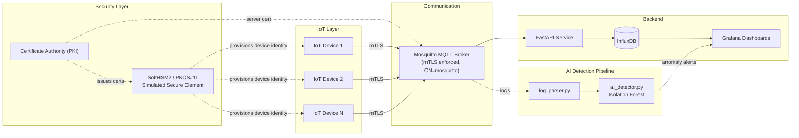

# 🔐 SecureIoT — PKI-Based mTLS Authentication & AI Anomaly Detection


> A containerized IoT security platform combining hardware-backed PKI authentication (mutual TLS) with real-time AI-based anomaly detection — built as a final-year engineering project (PFE).

---

## 📌 Overview

IoT devices are frequently deployed without strong identity guarantees, making them easy targets for spoofing, man-in-the-middle attacks, and unauthorized access. Traditional PKI is difficult to deploy on resource-constrained devices, and few student or prototype projects test **hardware-backed** identity before committing to physical Secure Element chips.

This project addresses both problems:

1. **Strong device identity** — a full PKI issues per-device X.509 certificates, with private keys generated and held inside a **SoftHSM2 (PKCS#11)** module that simulates a hardware Secure Element, enforcing mutual TLS (mTLS) between every IoT device and the message broker.
2. **Behavioral security** — even authenticated devices can behave anomalously (compromised firmware, replay attacks, unusual traffic patterns). A machine learning pipeline continuously analyzes broker logs and flags anomalies in near real time.

The result is a defense-in-depth architecture: cryptographic identity at the network layer, and behavioral monitoring at the application layer.

---

## ✨ Key Features

- 🔑 **Full PKI** — custom Certificate Authority issuing and managing X.509 certificates for every device and service
- 🛡️ **Simulated Secure Element** — SoftHSM2 + PKCS#11 for hardware-backed key storage and signing operations, without needing physical secure hardware
- 🔒 **Mutual TLS (mTLS)** — every MQTT connection is authenticated on both ends; no device or broker is trusted by default
- 🤖 **AI anomaly detection** — an Isolation Forest model trained on parsed broker/network logs to flag abnormal device behavior
- 🐳 **Fully containerized** — every component (broker, backend, database, dashboards, AI engine) runs in Docker for reproducible deployment
- 📊 **Live monitoring** — Grafana dashboards fed by InfluxDB for real-time visibility into device activity and detected anomalies

---

## 🏗️ Architecture



*(This Mermaid diagram renders natively on GitHub. Swap in a screenshot of your Grafana dashboard below it if you want extra polish.)*

---

## 🛠️ Tech Stack

| Layer | Technology |
|---|---|
| Containerization | Docker, Docker Compose |
| Messaging / Transport | Eclipse Mosquitto (MQTT over mTLS) |
| Security / PKI | OpenSSL, SoftHSM2, PKCS#11 |
| Backend API | FastAPI (Python) |
| Time-series storage | InfluxDB |
| Visualization | Grafana |
| Machine Learning | scikit-learn (Isolation Forest) |
| Core language | Python |

---

## 🔒 Security Design

The PKI is the trust root for the entire platform. Every certificate — device and broker alike — chains back to a single Certificate Authority, with the Mosquitto broker's server certificate issued under `CN=mosquitto`. Private keys for device identities are generated and stored inside a SoftHSM2 token, accessed through the PKCS#11 interface — the same interface used by real hardware Secure Elements — so cryptographic operations (signing, key storage) never expose raw private key material to the application layer.

Mutual TLS means the broker authenticates every device certificate, and every device authenticates the broker's certificate, before any MQTT traffic is exchanged. No device is implicitly trusted by network location alone.

> ⚠️ **Note on credentials:** this repo does not include real credentials. Default service passwords (InfluxDB, Grafana, etc.) should always be overridden via environment variables (see `.env.example`) and never committed to version control — even for a demo/academic project.

---

## 🤖 AI Anomaly Detection

Broker and network logs are parsed (`log_parser.py`) into structured features and fed into an **Isolation Forest** model (`ai_detector.py`), chosen for its efficiency on unlabeled, high-dimensional data and its suitability for detecting rare, abnormal events without needing large labeled attack datasets.

| Metric | Score |
|---|---|
| Accuracy | 82.5% |
| Recall | 99% |

Recall was intentionally prioritized over raw accuracy: in a security context, a missed intrusion (false negative) is far more costly than an extra false alarm. The model is tuned to catch as many true anomalies as possible, even at the cost of some false positives a human analyst can triage.

---

## 🚀 Getting Started

### Prerequisites
- Docker & Docker Compose
- OpenSSL
- SoftHSM2

### Installation

```bash
# Clone the repository
git clone https://github.com/<your-username>/<repo-name>.git
cd <repo-name>

# Configure environment variables
cp .env.example .env
# edit .env with your own values before continuing

# Build and launch all services
docker-compose up --build
```

### Access
- Grafana dashboard: `http://localhost:<port>`
- FastAPI docs: `http://localhost:<port>/docs`

*(Update ports/paths above to match your actual `docker-compose.yml`.)*

---

## 📁 Project Structure

```
.
├── docker-compose.yml
├── pki/
│   ├── ca/
│   ├── certs/
│   └── softhsm2-config/
├── broker/
│   └── mosquitto.conf
├── backend/
│   ├── main.py
│   └── requirements.txt
├── ai-detection/
│   ├── log_parser.py
│   └── ai_detector.py
├── grafana/
│   └── dashboards/
├── .env.example
└── README.md
```

*(Adjust this tree so it matches your real repository layout.)*

---

## 🎓 Academic Context

This project was developed as a **Projet de Fin d'Études (PFE)** for the Licence in Network and Systems Engineering (*Ingénierie Réseau et Systèmes Informatiques*) at **ISSAT Mateur, Université de Carthage**, Tunisia, and was successfully defended in [month/year].

## 👥 Authors

- **[Your full name]** — [GitHub](https://github.com/) · [LinkedIn](https://linkedin.com/)
- **Mohamed Aziz Khemissi** — co-author

## 🙏 Acknowledgments

Thanks to our project supervisor(s), **[Supervisor name(s)]**, for their guidance throughout this project.

## 📄 License

This project is released under the [MIT License](LICENSE) — swap in a different license if you'd prefer.
